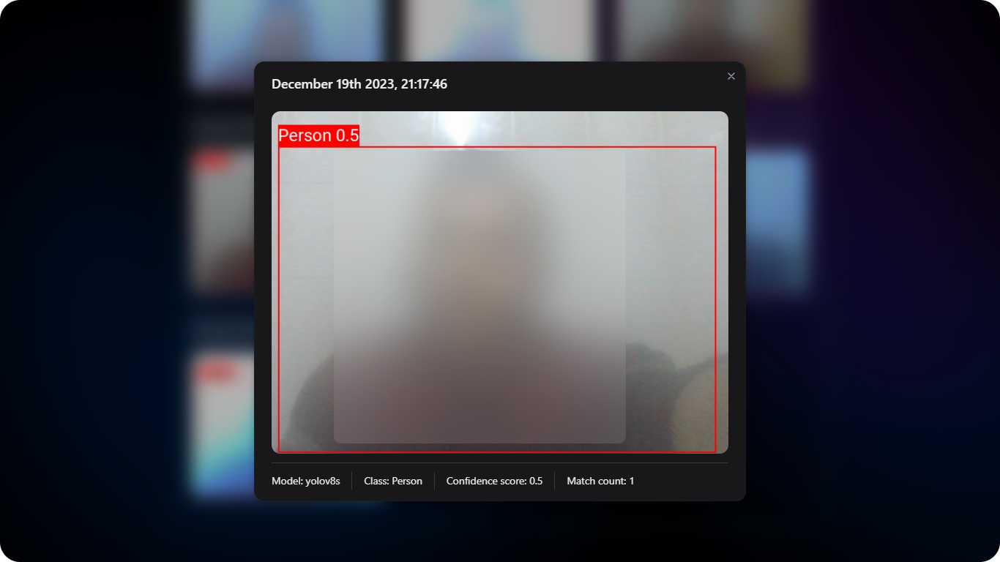

# Yolo v8 Object Detection

## Topic

Detecting objects in real-time, with a focus on Person class.

## Technology Choices

## Object Detection Model - Publisher Demo

## Message Broker Demo

- Consists of a single queue named `captured`.
- This queue is empty as all messages have been acknowledged.

## Backend Demo

- `/data` endpoint returns data saved in the MongoDB database.
- `/images/<timestamp>` returns saved images in `/captured/:<timestamp>.jpg` disk path.

## Frontend Demo

